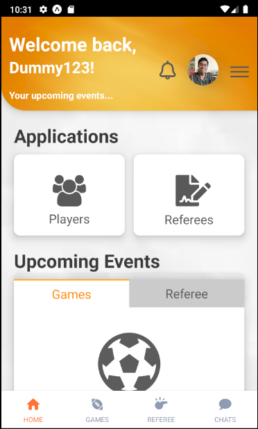

# Olym-one

## User Interface

## About
### Introduction
Welcome to Olym-one, an expo app which bring like minded athletes together! This app allows users to create and join games both as a player and referee! This repository only include the raw files and codes. Libraries and expo must be install and to use the app. Click on this [link](https://drive.google.com/file/d/1YPQ8P4TU9cMy7WhbVayGhP67e7OICFs3/view?usp=sharing) to watch the demo video of the application.

### Usage
#### Link to expo app: https://expo.io/@ashleylau451/Olymone1
We have created two dummy accounts if you do not wish to create one. It is however recommended to create one yourself to walk through the authentication process: 
 
Email: ashleylau451@hotmail.com  
Password: 123455  
Email: ashleylau451@gmail.com  
Password: 123456
